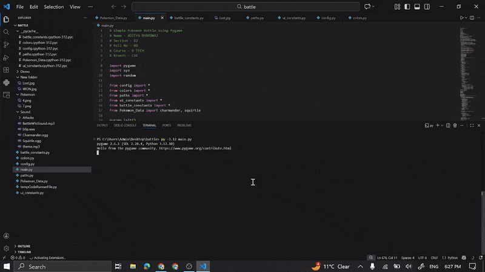

# 🎮 Simple Pokémon Battle Game

A turn-based Pokémon-style battle game developed using **Python** and **Pygame**.
Inspired by classic Pokémon battles, this project focuses on clean code structure, smooth animations, sound effects, and an engaging battle flow.

---

## 👤 Author Details

* **Name:** Aditya Bhardwaj
* **Course:** B.Tech
* **Branch:** Computer Science & Engineering

---

## 🧠 Project Overview

This project simulates a **one-on-one Pokémon battle** between **Charmander** and **Squirtle**. Players select moves through a menu-driven system while the game manages turns, damage calculation, animations, and battle outcomes.

The codebase is **modularized** across multiple files, separating configuration, UI constants, battle logic, and Pokémon data. This makes the project easier to understand, maintain, and extend.

---

## ✨ Features

* Turn-based Pokémon battle system
* Animated dialogue box (typewriter effect)
* Dynamic HP bars with color indicators
* Move selection menu
* Pokémon cries and attack sound effects
* Screen vibration effect on damage
* Background music during battle
* Win and loss end screens
* Restart battle using **ENTER** key

---

## 🎮 Controls

| Key        | Action            |
| ---------- | ----------------- |
| Arrow Keys | Navigate menus    |
| ENTER      | Select / Continue |
| ESC        | Quit the game     |

---

## 📁 Project Structure

```text
battle/
│
├── main.py                 # Main game loop
├── config.py               # Screen, font, FPS settings
├── colors.py               # Color constants
├── paths.py                # Asset paths
├── ui_constants.py         # UI layout constants
├── battle_constants.py     # Battle & animation settings
├── Pokemon_Data.py         # Pokémon stats and moves
│
├── Pokemon/                # Pokémon sprites
│   ├── 4.png
│   └── 7.png
│
├── Sound/                  # Audio assets
│   ├── theme.mp3
│   ├── blip.wav
│   ├── BattleWInSound.mp3
│   ├── Charmander.ogg
│   ├── Squirtle.ogg
│   └── Attacks/
│       ├── Scratch.mp3
│       ├── Growl.mp3
│       └── Tackle.mp3
│
├── New folder/             # Result screens
│   ├── WON.jpg
│   └── Lost.jpg
│
└── Demo/                   # Gameplay previews
    ├── Battle.JPG
    └── Demo.gif
```

---

## ⚙️ Requirements

* Python **3.10+**
* Pygame

Install dependency:

```bash
pip install pygame
```

---

## ▶️ How to Run

1. Open a terminal in the project folder
2. Run the game using:

```bash
python main.py
```

---

## 📸 Game Demo

### Gameplay Demo (GIF)



### Battle Screenshot


---

## 📚 Concepts Used

* Game loop and event handling
* Modular programming
* State management
* Animation and timing control
* Sound integration
* Basic UI/UX design for games

---

## 🚀 Future Improvements

* Add more Pokémon
* Type-based damage system
* Items such as Potions and Revives
* Pokémon switching during battle
* Difficulty levels
* Start menu and pause screen

---

## 🏁 Conclusion

This project demonstrates core **game development fundamentals** using Python and Pygame. It combines logic, visuals, and audio to create a complete and interactive mini-game experience.


